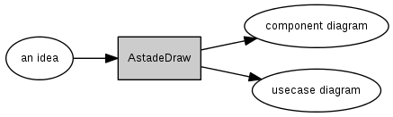
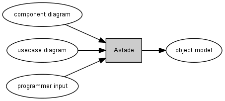
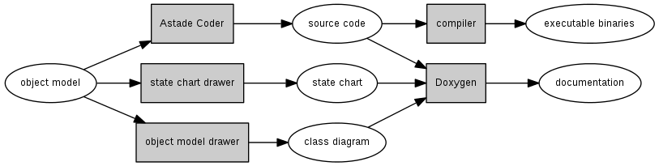

Astade, an UML tool for the complete C or C++ development process
=================================================================

design
------

architecture
------------

implementation
--------------

Continious integration
----------------------

You can reach our Continious Integration Server here: [Jenkins](http://dev.astade.de)
