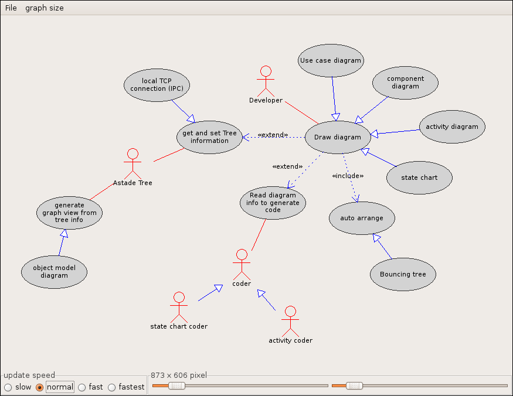
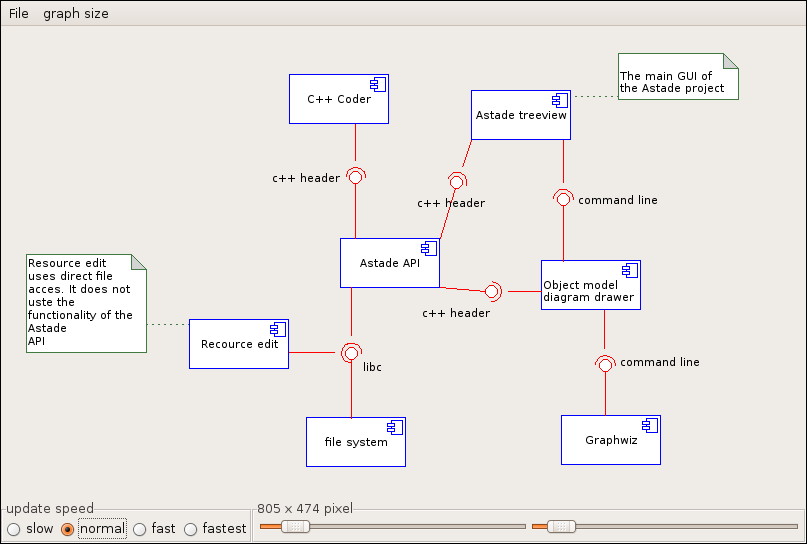
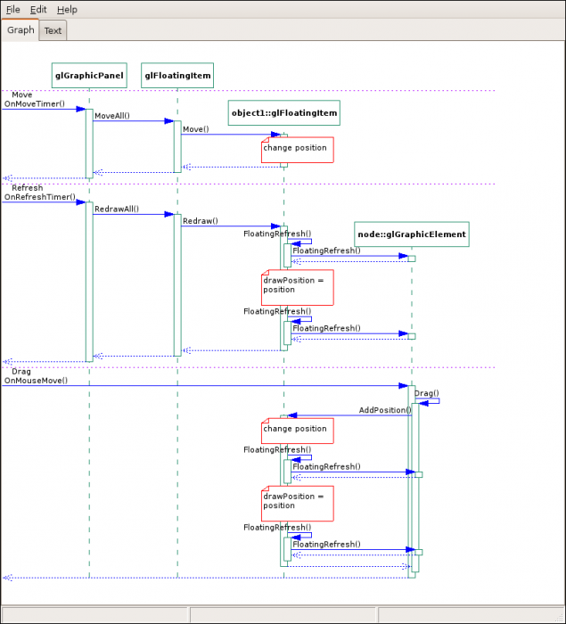
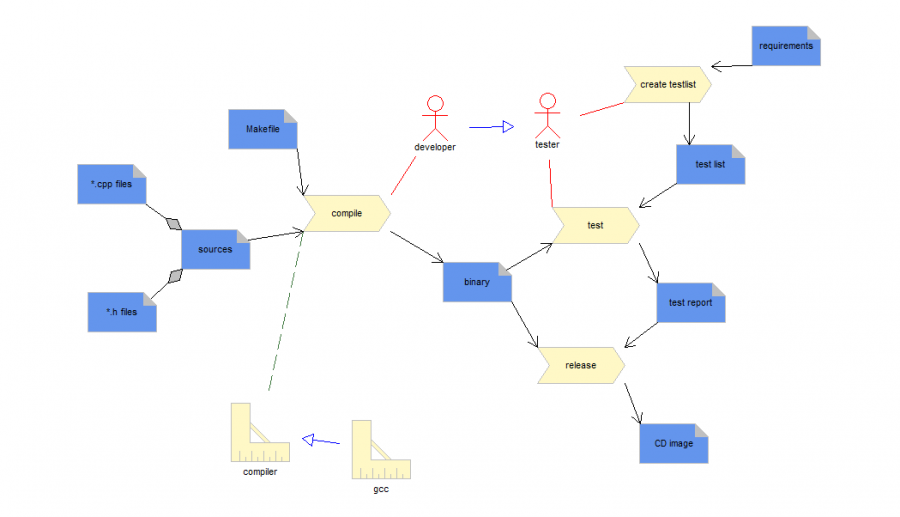

Astade Screenshots
==================

Usecase Diagram
---------------

Component Diagram
-----------------

Sequence Diagram
-----------------

State Diagram
-----------------

Spem Diagram
------------

Also not an UML diagram, the spem diagram is a useful add on in the software development process. Spem diagrams are not used to describe the behavior of the software nor static architecture of software.

Spem diagrams are used to describe processes. And therefore can be used to describe software development processes.

The following diagram is done with AstadeDraw. It describes (partly) the (well known) steps for the software development. The picture is intended to give an idea, how to use spem diagrams.

